## 配环境

#### 编译器导致的编译失败

##### 1 powershell

先给 `MSVC` 编译器设环境变量(之前以为永远用不着就手动删了)：
https://superuser.com/questions/1652709/how-to-setup-environment-variable-for-msvc-in-windows-like-gcc

遇到了 `vscode` 中的 `powershell` 识别不到 `MSVC` 编译器但 `cmd` 能识别的问题：

参阅资料解决：https://zhuanlan.zhihu.com/p/639866697

##### 2 cuda

`cuda` 报错说不支持当前 `MSVC` 的版本，只支持 `2017-2022`，但我装的确实是 `MSVC2022`：

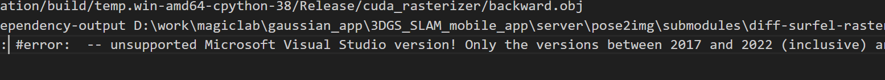

查阅网上资料，`MSVC2022` 在设计之初版本号范围是 `v1930-v1939`。因此 `cuda` 在检查版本的时候要求版本小于 `1940`，但 `MSVC2022` 的小版本更新太多了，导致 1940 也被用作 `MSVC2022` 的版本号：
原理：
https://stackoverflow.com/questions/78515942/cuda-compatibility-with-visual-studio-2022-version-17-10
解法（未成功，猜测对 1940 是有用的，但 1941 不行）：
https://github.com/graphdeco-inria/gaussian-splatting/issues/954

发现我的 `MSVC` 确实属于`v143`，小版本号是 `1941`，认为和以上 `1940` 情况应该是一致的：

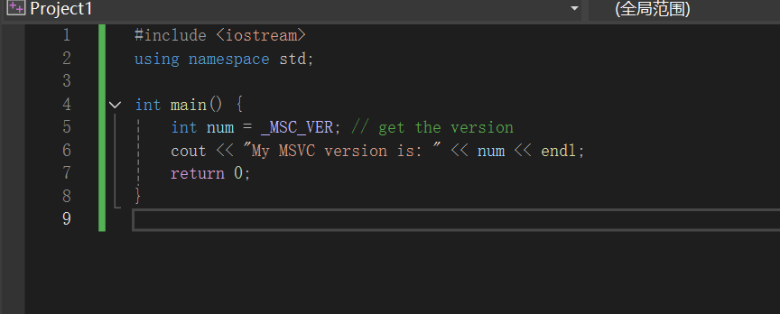
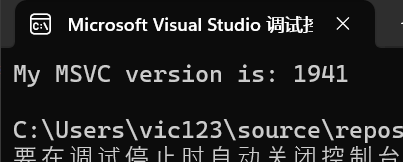

因此尝试在获取当前 MSVC 版本后通过修改 cuda 的头文件绕开：

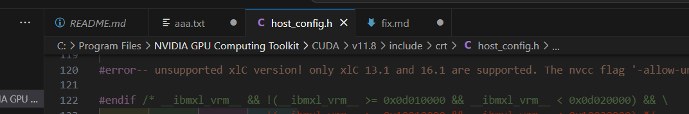
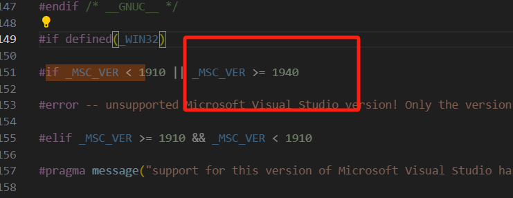

##### 3 MSVC

这下 `cuda sdk` 满意了，但 `MSVC` 又不满意了。原来是从 `MSVC 1441` 开始只支持 `12.4` 以上的 `cuda`：
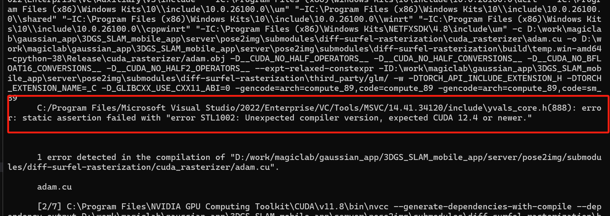

查阅 `MSVC PR`，提到了可以通过定义一个宏绕开，但还是老老实实选择卸载 `VS 2022` 去装 `VS 2019` 吧

https://github.com/microsoft/STL/pull/4475
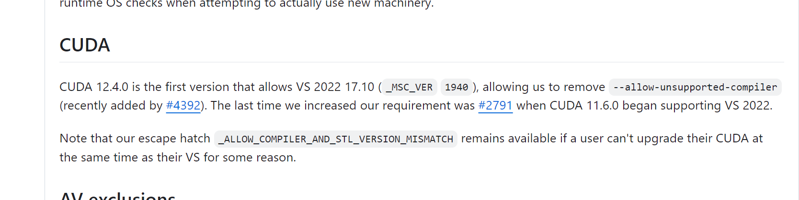

装完 `MSVC2019` 后总算不报 `MSVC` 相关的错误了

#### 代码问题导致的编译失败

这个诡异的星号可能用了奇怪的编码格式，导致编译器忽略他和下一行,删了就好饿

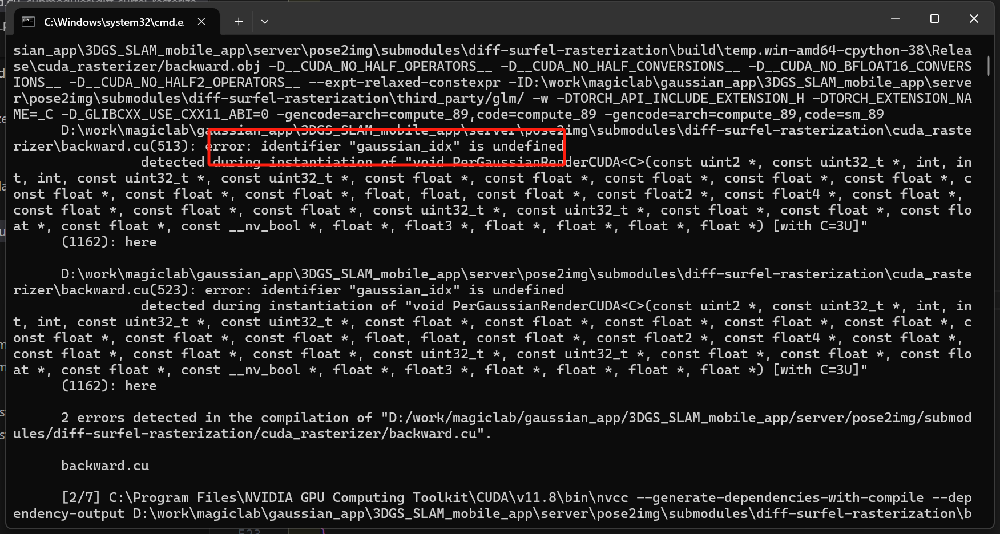
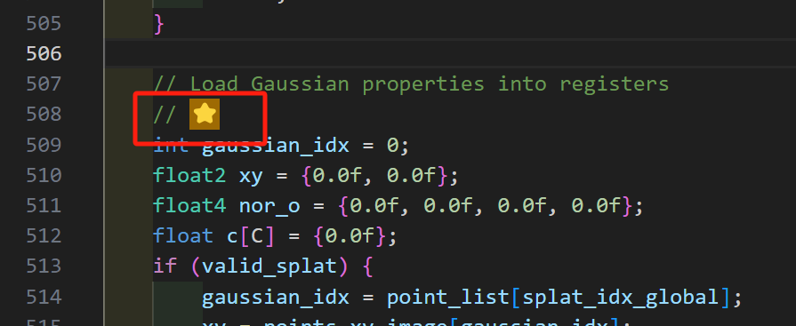

不认\然后换行（神奇？）也删了
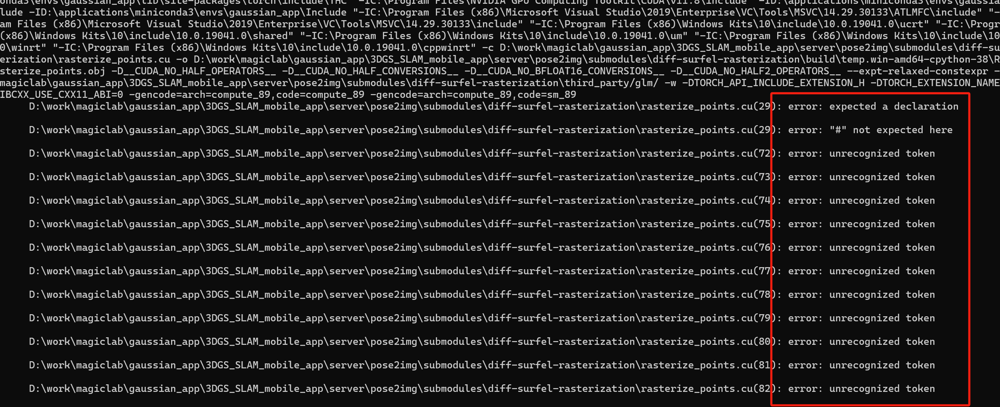

##### 现在是 2024-9-28 1:12 `diff-surfel-rasterization` 终于编译过了

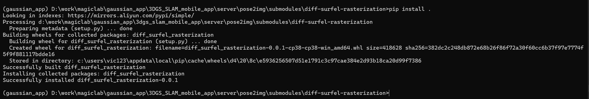

#### 跑 `render.py` 需要额外的库

`conda install scipy matplotlib open3d lietorch wandb plyfile opencv-python`

又寄了 `pytorch3d` 好像只有支持 `py3.9` 的二进制文件 自己编译也没过 这下 `python` 环境要从头来了 早知道当时就重开一个 3.9 不用之前的 3.8 了

重配环境之后还是找不到符合依赖要求的包。一看，草为什么只有给 `linux` 用的的二进制包
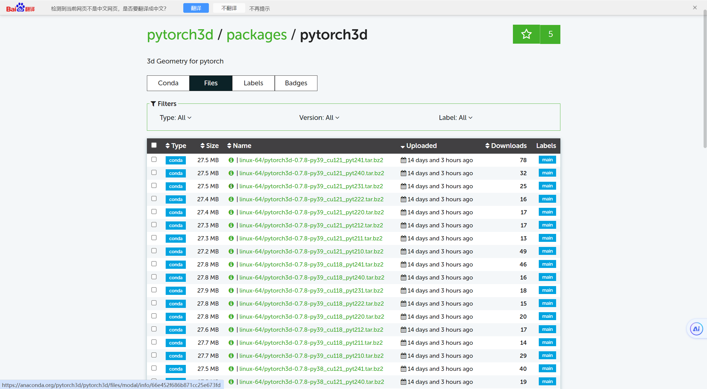

https://zhuanlan.zhihu.com/p/609391678
好好好，自己编译 `pytorch3d` 过了
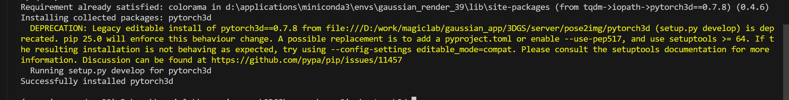

又急，`lietorch` 和当前环境的不知道什么东西不兼容
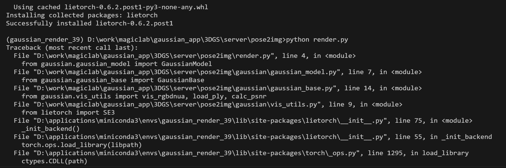
摸不着头脑，conda 源里写的 `python>=3.10`，那我是怎么把 `lietorch` 安装下来的
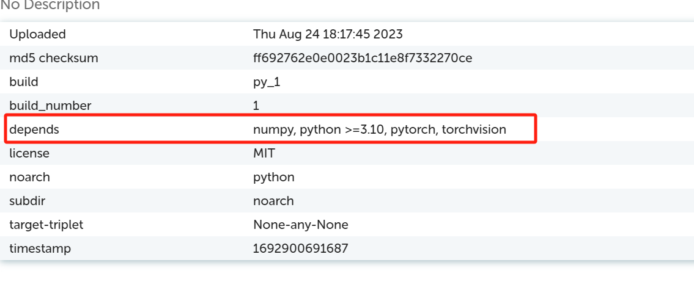
算了也手动编译好了。。。
怎么自己编译出 `lietorch` 版本是 0.2
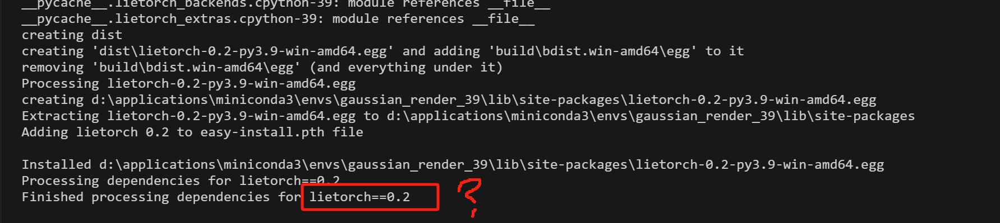
原来作者是手动管理版本的。。。上次修改版本号还是 2021 年。谴责一下
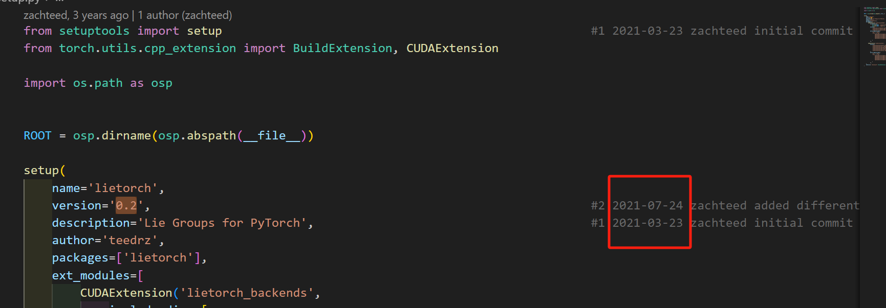

### winwin😋

能跑了
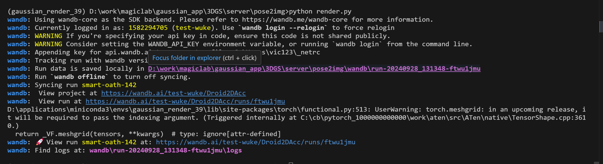
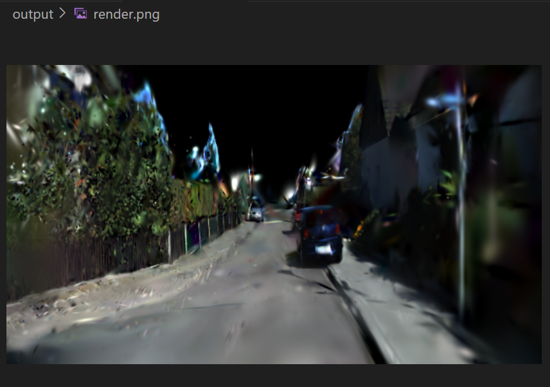

#### 资料

解释了编译 `cuda` 为什么要用 `MSVC`
https://stackoverflow.com/questions/57450317/confusion-about-cuda-installation-instructions-what-exactly-is-microsoft-visual

提到了一种不需要装完整 `visual studio` 编译 `cuda` 的方法
https://snackshark.blogspot.com/2021/05/set-up-cuda-without-visual-studio-oneof.html
